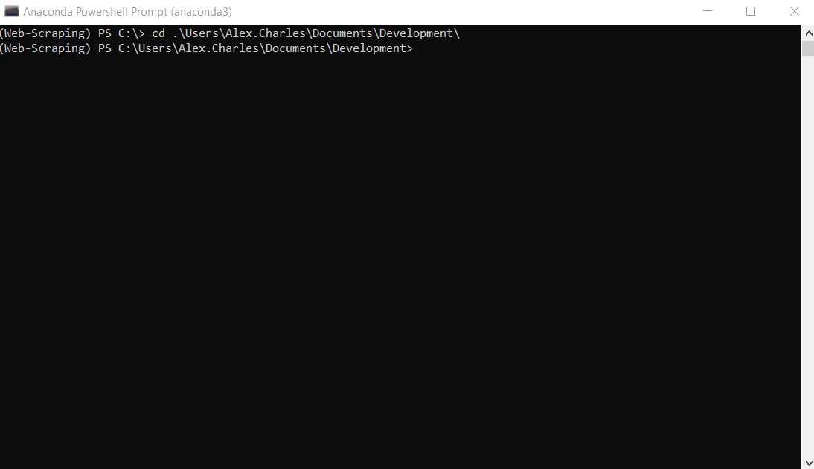

# LinkedIn Web Scraper

This program scrapes provided LinkedIn public URLs pulling:
- Name
- Full Job History:
    - Company
    - Position
    - Dates
- Full Education History
    - Degree Type
    - Degree Subject
    - Degree Description
    - Degree Dates

Along with these different parameters, emails and skills have also been soft-coded which can be easily added to the
 scraper, and with a small amount of additional work the modular design of the scraper should make it fairly quick to add any other required fields.


## Prerequisites

You must have installed in your machine (higher versions are fine):
* Python 3.7 - virtual env
   * For windows users this can be installed through using the anaconda application on the software centre
* A text editor, not necessary but useful for modifying input files  - recommend (Atom)[https://atom.io]


## Installing

In order to get this software running on your local machine a few install steps are required. This is written as verbose
a possible for those who have have never coded before, don't be alarmed these actually takes just a couple of minutes.
 Follow these steps to the letter and the software should work without a hitch.

1. Install python on your local machine, if you are a windows users this is best done by installing Anaconda:
    1. If on a work PC - go to the software centre and download from there, otherwise download the application from [Anaconda](https://www.anaconda.com/products/individual)
    2. Follow the setup instructions - sometimes this trips up and needs a second attempt
    3. When installed fire up an application called: Anaconda Powershell Prompt (this is a terminal for working with python), on windows this can be found by pressing the Windows Key and searching
    4. Python is now installed
2. In order to keep everything tidy a virtual python environment is needed:
    1. In the Powershell prompt type:
         ```
            conda create --name Web-Scraping python=3.7
         ```
        - N.B. the name can be replaced with anything you want
        - Wait a few moments and this will run a few commands to create the python environment, when a new line appears you know the process is complete
    2. To see what environments are available type `conda env list` remember this in case you forget the environment name
    3. If the new environment `Web-Scraping` is listed you are good to go. Lets now activate this so you can use it: windows: `conda activate Web-Scraping`, mac: `conda source activate Web-Scraping`
        - on Powershell the name in brackets on the LHS should change from anaconda3 -> Web-Scraping letting you know which python environment is running
    
3. Lets now download the scraper:
 1. First choose a folder to place this code into - I use `Users\Alex.Charles\Documents\Development\`
 2. To access a directory use the `cd` command i.e. `cd  Users\Alex.Charles\Documents\Development\`
    - Top tips:
        - `ls` to see all files in the directory
        - `cd ..` to go up one directory level
        - `cd ` then tab autocomplete and scroll through folders (type and keep hitting tab until you get to the correct one)
 3. Now we are going to download / clone the LinkedIn scraper to you local machine:
    1. In the directory of choice type:
        ```
            git clone https://github.com/elvinos/LinkedInScraper.git
        ```
    2. That's it - if you aren't feeling brave you can also do this manually clinking the clone button on the github page
 
 4. Install package requirements:
    1. Change to the new LinkedInScraper directory:
    `cd LinkedInScraper`
    2. Make sure that Web-Scraper is still the python environment you are working in then install the packages with:
        ```
        pip install -r requirements.txt
        ```
    3. This will install all the packages required for the scraper to run, give it a few minutes
    
 4. Finally configure the Web Scraper to the correct files and accounts:
    ```
        python configurator.py
    ```
    -  Follow the prompted instructions filling out thew input and output files - it is fine to change these later
    - LinkedIn login details are kept safe on you local machine, so don't worry about security here... you can change these if you are rotating profiles
    - *If it's the first time, set the configuration as suggested by the messages that will be printed by the configurator*
    - *Any time in the future you can easily re-run the configuration to change for example name of input / output files*
 5. Take a test run:
    ```
    python scrape.py
    ```
    - if all is successful it should fire up a chrome browser and scrape the profiles in the input file
    

## Executing

There are two ways you can run the code: normal and headless

In both cases, be careful (especially when you scrape a lot of profiles), your computer may sleep or LinkedIn may throw a Captcha screen.

**NB** Make sure that you are using Anaconda Power Shell and have activated the Web Scraping virtual env before continuing. If you have followed the installation steps to do this simply type:

```
conda activate Web-Scraping
```
This should then show Web Scraping on the LHS of the line in the Power Shell window

### Normal execution
In this mode the script will do scraping opening a real Chrome window.

**Pros:** In this case you will be able - if prompted - you will need to satisfy the Captcha check to continue the scrape, so you should keep and eye while it is running.

**Cons:** Be aware that if you choose this mode you can not loose the focus on the window, otherwise no data will be scraped.

To run in normal mode:
```
python scrape.py
```

### Headless execution
In this mode the script will do scraping without opening a real Chrome window.

**Pros:** The scraping process is distributed into many threads to speed up to 4 times the performance. Moreover, in this way you can keep on doing your regular business on your computer as you don't have to keep the focus on any specific window.

**Cons:** If LinkedIn throws a Captcha check there is no way for you to fill in the Captcha. The script will detect this particular situation and terminate the scraping with an alert: you will have hence to run the script in normal mode, do the captcha, and then you can proceed in scraping the profiles that were left.

To run in headless mode:
```
python scrape.py HEADLESS
```

### Examples

Only LinkedIn URL:
```
https://www.linkedin.com/in/perosn1/
https://www.linkedin.com/in/someoneelse/
```

When the Chrome page closes, it means the program ended.
You can find inside the `LinkedInScraping` folder the extracted data in the results file `Scraped/results_profiles.xlsx`.
The file name will contain concatenated the current timestamp if the configuration was set as suggested.


## Common problems in Running

### Selenium WebDriverException
In case you get an error message similar to the following:
```
selenium.common.exceptions.WebDriverException: Message: unknown error: cannot find Chrome binary
```
please run again `configurator.py` and be sure to specify a correct path to your chrome.exe executable in Windows or the chrome folder in Linux.

### Human check freezing the scraping
It may happen that while scraping the script will warn you about the need to perform a Human Check (a Google Captcha) even if it's not prompted for real.

This happens when you inserted in the input file a Profile URL which is not correctly formatted.

Here some tips:
* The profile URL should always end with `/`
* Open a browser window and navigate to such URL. Wait for the page to load. Is the URL currently in the browser navigation bar the same as the one you initially inserted? If not, you should insert in the input file the one you see now at the navigation bar.

## Customizing

You can customize the configurations easily re-running `configurator.py`.

You can also customize the code in many ways:
*The easy one is changing the order how the data is inserted in the excel file, or renaming the excel file headers.
*The harder one is to do scraping of additional data: have a look at the Acknowledgments down here or feel free to reach me out to propose new code.